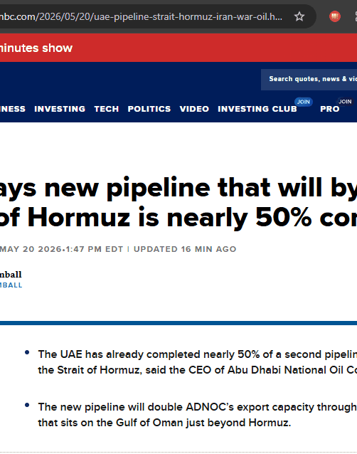

# 🔍 Bias Heatmap

> **See the spin, highlighted on the actual page.**
> Maps loaded language, unverified claims, and well-sourced facts across any news article instantly using AI.

---

## 📖 The Problem & The Solution

News articles often appear neutral and objective on the surface, but are loaded with subtle editorial spin, unsupported assertions, or unverified claims.

**Bias Heatmap** analyses the active page's text in one click, mapping loaded phrases, unverified claims, and objective facts. No content is rewritten—manipulative language is simply flagged and explained verbatim, letting you separate journalism from propaganda.

---

## ⚡ Core Features

- 🟥 **Loaded Language Detector** — Flags emotionally charged or manipulative phrases quoted verbatim, alongside a concise explanation of their subtext.
- 🟨 **Unverified Claims Scanner** — Highlights statements made without evidence, missing citations, or those hidden behind anonymous sourcing.
- 🟩 **Well-Attributed Facts Classifier** — Identifies properly cited, highly credible statements that hold up to standard journalistic scrutiny.
- 📊 **Political Bias Summary** — Computes a political direction scale (Left / Right / Center), an overall bias score out of 10, and a total loaded phrase count.
- ⚖ **One-Line Verdict** — Summarizes the main spin angle of the article and explicitly answers: *Who benefits from this narrative?*
- ⏱ **Two-Phase Progressive Loading** — Displays an instant metadata scanning preview while the underlying AI performs a deep textual analysis.

---

## 🛠 Getting Started

### 1. Load the Extension
1. Clone this repository locally.
2. Open Chrome and navigate to `chrome://extensions`.
3. Toggle on **Developer mode** in the top right.
4. Click **Load unpacked** and select the `bias-heatmap` folder.

### 2. Configure Your Keys
Open the extension popup, click the **⚙** gear icon at the top right, and paste your API key:
- **Gemini Key** — Get one for free at [aistudio.google.com](https://aistudio.google.com/apikey).
- **OpenRouter Key** (fallback) — Get one at [openrouter.ai](https://openrouter.ai).

> [!TIP]
> If both keys are configured, the extension defaults to Gemini and automatically falls back to OpenRouter when your Gemini quota runs out.

---

## 🔧 Technical Stack

- **Extension Framework**: Chrome Extension Manifest V3
- **Primary AI Engine**: Gemini 2.0 Flash via AI Studio SDK
- **Fallback Engine**: OpenRouter API
- **Client Implementation**: Pure Vanilla JS, no build steps, zero bulky dependencies. Runs directly out of the folder.

---

## 📅 180 Days of Building
This project is part of a larger developer journey: shipping one useful AI tool/extension every day for 180 days.

Follow along for daily releases and tech-stack deep dives:
- **Twitter / X**: [@happy_ships](https://x.com/happy_ships)
- **Day**: `06 / 180`
- **Next Release**: `Antigravity Skill Forge`

---

*Licensed under the [MIT License](LICENSE).*
